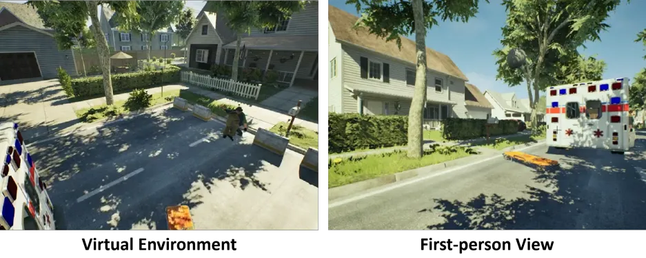
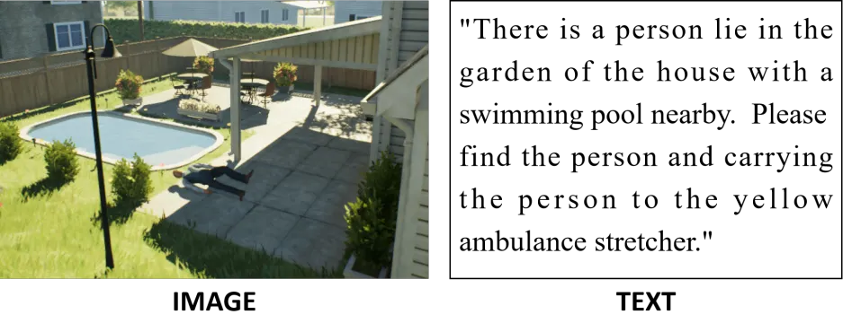

ATEC_competition_demo_code_2025
===

[//]: # (Gym-Rescue: )
**This project integrates Unreal Engine with OpenAI Gym for a rescue task based on [UnrealCV](http://unrealcv.org/).**  

# Introduction

**This repository is a specialized branch of the [unrealzoo project](http://unrealzoo.site/), tailored to simulate rescue task scenarios. It provides an interactive environment where agents can be trained and tested for rescue task in virtual worlds.**

**1.Simulation Interaction Environment:**  
Different from traditional computer vision tasks, contestants need to conduct real-time dynamic interactions in the virtual environment provided by this competition. Contestants can use this virtual simulation platform for data collection and strategy training, and the final scoring of the competition will also be evaluated on the same platform.

Examples of the simulation environment used in the competition and the first-person perspective images of the intelligent agent are shown below:


**2.Interaction Interface:**  
Contestants can interact with the environment through a gym-like Python interface to obtain the initial clues (a color image and a text description), as well as the first-person perspective observation information (RGB image) of the intelligent agent. They can also control the real-time movement of the intelligent agent in the environment, execute actions, and receive reward signals.

Examples of the clues obtained by the intelligent agent at the initial stage.  


# Installation

## Dependencies
UnrealCV, Gym, CV2, Numpy, Docker(Optional), Nvidia-Docker(Optional)
 
We recommend you use [anaconda](https://www.continuum.io/downloads) to install and manage your Python environment.

```CV2``` is used for image processing, like extracting object masks and bounding boxes. ```Matplotlib``` is used for visualization.


It is easy to install, just activate your python environment and install dependency package
```
pip install -r requirements.txt
```


## Run the baseline code
```
./run_main.sh
```
## Task Demonstration
We provide a task execution example to help participants better understand the task. Participants can:  
    - Control the agent via keyboard to complete the rescue mission ```--keyboard```.  
    - Observe a randomly controlled agent navigating the environment.  
By adding the parameters ```--render``` and ```--record_video```, participants can visualize the agent’s first-person perspective and save the entire observation sequence as an MP4 file, gaining a clear understanding of the success and failure criteria.
### Run a keyboard controlled agent, visualize and save to output.mp4
    - Use `i`, `j`, `k`, `l` for agent movement  
    - `1` for pick  
    - `2` for drop  
    - `e` for open the door  
    - `space` for jump  
    - `ctrl` for crouch  

```
python example/rescue_demo.py --render --record_video  --keyboard
```

### Run a random agent, visualize it
```
python example/rescue_demo.py --render 
```


##  Acknowledgments
We acknowledge the following projects for their contributions:
- [UnrealCV](https://unrealcv.org/)
- [OpenAI Gym](https://gym.openai.com/)
- [Unreal Engine](https://www.unrealengine.com/)
- [UnrealZoo](http://unrealzoo.site/)


